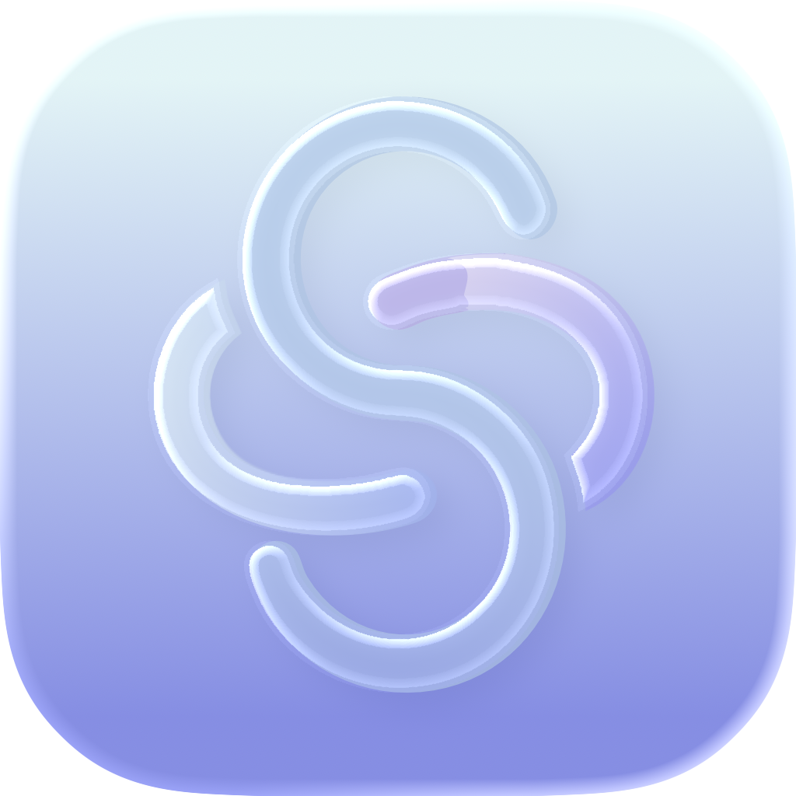

# Shabon

<p align="left">
  
</p>

[](./LICENSE)
[](#開発背景)
[](#構成)
[](https://expo.dev)
[](https://supabase.com)

AI キャラクター「メイト」と深い対話を楽しむ iOS アプリ。
**記憶を持つ AI との、親密で手触りのある会話体験**を目指して設計した個人開発モバイルアプリ。

> 📱 App Store 審査にキャプチャ不備で rejected、そのままポートフォリオとして凍結。

---

## なぜ作ったか

既存の AI チャットアプリに感じた不満：

- **機械的な応答** — キャラクター性が薄く、毎回「リセット」される対話
- **UI の無個性** — チャット欄 + 吹き出し、以上
- **記憶の欠落** — 前回話した内容を覚えていない

これを「**AI が人格を持ち、記憶を積み上げ、触れて楽しい UI で会話する**」体験に作り変える試み。

## 技術ハイライト

| レイヤ | 実装 |
|--------|------|
| UI 表現 | **Skia シェーダー** によるオーガニック UI / **Liquid Glass UI** (iOS 26 / expo-glass-effect) |
| AI 対話 | Google Gemini Flash / DeepSeek 切替え、キャラクター別プロンプト設計 |
| 記憶機能 | **pgvector (Supabase)** による RAG、会話要約 → ベクトル化 → 類似検索で過去会話の呼び戻し |
| 認証 | Apple Sign In + Google OAuth |
| インフラ | Expo EAS ビルド / FastAPI + Supabase / Sentry モニタリング |

## 構成

```
shabon/
├── shabon-app/   # React Native + Expo (フロントエンド)
│   ├── app/       # Expo Router
│   ├── components/
│   ├── modules/
│   └── services/
├── shabon-api/   # Python FastAPI (バックエンド)
│   ├── alembic/    # DB migration
│   └── main.py
└── supabase/     # Postgres スキーマ + RLS ポリシー
```

## 技術スタック

**フロント**: React Native 0.81 / Expo 54 / Expo Router / TypeScript / Skia / Reanimated
**バックエンド**: Python / FastAPI / SQLModel / Alembic
**データ**: Supabase (Postgres + pgvector) / Row Level Security
**AI**: Google Gemini / DeepSeek / Jina Embeddings
**ビルド/配信**: EAS Build / TestFlight / Sentry

## 開発背景

全ての出発点となった個人開発プロジェクト。

- **Skia シェーダー** を自分で書いて UI を組む経験
- **pgvector** で RAG を手組みする経験
- iOS アプリを **個人で App Store まで持っていく** 経験（審査落ち含む）

ここで得た「**シェーダー × AI × モバイル**」の組み合わせが、後の他プロジェクト（react-shadertoy, engram, shader-forge, shabon/fx 等）の礎になっている。

## ライセンス

[MIT](./LICENSE). 自由に読んで、試して、フォークして、作り変えてください。

## 関連プロジェクト

- [@shabon/fx](https://www.npmjs.com/package/@shabon/fx) — React + Three.js + GLSL エフェクトライブラリ
- [react-shadertoy](https://www.npmjs.com/package/react-shadertoy) — Shadertoy GLSL → React wrapper
- [engram](https://github.com/wrennly/engram) — RAG memory layer for AI agents
